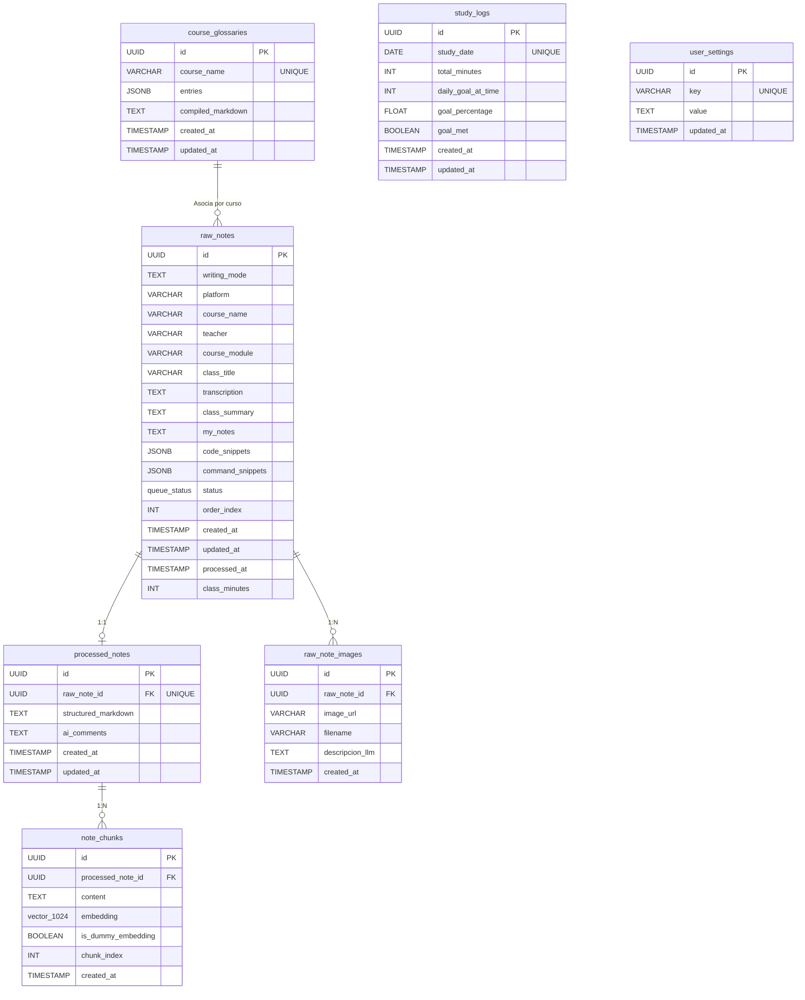

# 🗄️ Base de Datos — PostgreSQL + pgvector

Este directorio contiene la configuración de la base de datos relacional y vectorial para el **Gestor Inteligente de Apuntes**. La persistencia se basa en **PostgreSQL 16** potenciado con la extensión **`pgvector`** para búsquedas semánticas ultrarrápidas y almacenamiento de embeddings de alta dimensionalidad.

---

## 🛠️ Stack y Configuración de Docker

La base de datos corre de forma aislada en un contenedor Docker. Sus archivos principales de configuración son:

*   **`docker-compose.yml`**: Define el servicio de base de datos (`db`) basado en la imagen oficial `pgvector/pgvector:16-pgdg` expuesto en el puerto `5432`.
*   **`.env.example`**: Variables de entorno de inicialización de PostgreSQL (usuario, contraseña y base de datos).

### Credenciales por Defecto (Desarrollo)
*   **Usuario**: `notes_user`
*   **Contraseña**: `notes_password`
*   **Base de Datos**: `notes_db`
*   **Puerto**: `5432`

---

## 📂 Contenido del Directorio

| Archivo / Script | Propósito |
|------------------|-----------|
| `docker-compose.yml` | Declaración del servicio de base de datos Dockerizado con volumen persistente `pgdata`. |
| `init.sql` | Script DDL completo de inicialización del esquema, tablas, tipos, índices HNSW/B-Tree y triggers. |
| `seed_data.sql` | Datos de prueba y notas prefabricadas para poblar el sistema inicialmente. |
| `migrate_images.sql` | Script de migración incremental que añade soporte para la carga física y análisis de imágenes. |
| `migrate_study_tracker.sql` | Script de migración que crea las tablas del rastreador de estudio y variables de configuración del usuario. |
| `migrate_glossary_flashcards.sql` | Script de migración que añade la tabla de glosario y densidad de flashcards. |
| `backup_pre_images.sql` | Dump SQL histórico previo a la integración de la tabla de imágenes. |

---

## 📐 Esquema Físico y Relaciones (DDL)

El esquema de base de datos organiza la cola de procesamiento, las notas generadas, los fragmentos semánticos, las imágenes de apoyo y las métricas de estudio:



### Detalle de las Tablas

#### 1. `raw_notes`
Representa la cola activa de estudio. Almacena las notas crudas antes de su síntesis por el agente.
*   `status`: Enum (`queue_status`) que puede tomar los valores `'pending'`, `'processed'` o `'failed'`.
*   `code_snippets` / `command_snippets`: Estructuras JSONB para el almacenamiento reactivo de fragmentos.
*   `class_minutes`: Minutos que representa la clase (usado por el *Study Tracker*).
*   `order_index`: Índice entero usado por el drag-and-drop del frontend para ordenar fichas por curso.

#### 2. `processed_notes`
Almacena el resultado de la síntesis del agente LangGraph.
*   Tiene una relación 1:1 con `raw_notes` (`raw_note_id` con restricción de borrado en cascada `ON DELETE CASCADE`).
*   `structured_markdown`: Ficha sintetizada estructurada bajo la plantilla Obsidian.
*   `ai_comments`: Recomendaciones pedagógicas, dudas o aclaraciones interactivas formuladas por el agente.

#### 3. `note_chunks`
Subdivisiones textuales de la nota procesada (hechas por headers `##` y `###`) creadas para RAG (Generación Aumentada por Recuperación).
*   `embedding`: Vector de 1024 dimensiones optimizado para Voyage-4 (`vector(1024)`).
*   `is_dummy_embedding`: Booleano que indica si el embedding es real o temporal (`[0.0]*1024` creado en modo offline). Se pueden re-procesar con el CLI o endpoint.

#### 4. `raw_note_images`
Asocia imágenes de apoyo subidas a RustFS con su correspondiente apunte crudo.
*   `descripcion_llm`: Texto descriptivo generado por Gemini 3.5 Flash al analizar la imagen, inyectado por el preprocesador en la nota cruda.

#### 5. `study_logs`
Rastrea el progreso diario de estudio del usuario.
*   `study_date`: Clave única para evitar duplicados del mismo día.
*   `goal_percentage`: El porcentaje completado de la meta de estudio.
*   `goal_met`: Indicador permanente (booleano) de si se alcanzó la meta ese día.

#### 6. `user_settings`
Almacenamiento clave-valor simple para configuraciones persistentes del usuario (ej: `daily_study_goal` para la meta de minutos diarios de estudio, `flashcard_density`).

#### 7. `course_glossaries`
Tabla donde se indexan automáticamente los conceptos clave detectados por el Agente de IA al procesar clases, generando un glosario continuo por curso.
*   `course_name`: Nombre del curso al que pertenecen los términos.
*   `entries`: Array de JSON con los conceptos, descripciones y referencias.
*   `compiled_markdown`: Versión renderizada en Markdown del glosario para consumo rápido en frontend.

---

## ⚡ Índices de Optimización

Para garantizar búsquedas instantáneas y operaciones fluidas en la cola, el esquema define los siguientes índices:

1.  **Índice de Estado en Cola (`idx_raw_notes_status`)**:
    *   **Tipo**: B-Tree
    *   **Propósito**: Acelera consultas sobre notas con estado `'pending'` por parte del worker en segundo plano.
2.  **Índice Cronológico (`idx_raw_notes_created_at`)**:
    *   **Tipo**: B-Tree
    *   **Propósito**: Ordenamiento rápido de apuntes por fecha de registro en el feed y cola activa.
3.  **Índice por Curso (`idx_raw_notes_course`)**:
    *   **Tipo**: B-Tree
    *   **Propósito**: Filtra y recupera velozmente notas de un curso específico.
4.  **Índice de Búsqueda Semántica (`idx_note_chunks_embedding_hnsw`)**:
    *   **Tipo**: **HNSW (Hierarchical Navigable Small World)** con la métrica de distancia de coseno (`vector_cosine_ops`).
    *   **Propósito**: Permite una recuperación semántica ultra-rápida y escalable al realizar RAG sobre grandes bases de datos.
5.  **Índice de Imágenes (`idx_raw_note_images_raw_note_id`)**:
    *   **Tipo**: B-Tree
    *   **Propósito**: Acceso veloz a las imágenes pertenecientes a una clase.

---

## 🔄 Automatización por Triggers

La base de datos automatiza la actualización del campo `updated_at` a través de una función PL/pgSQL y disparadores antes de la actualización de filas (`BEFORE UPDATE`):

```sql
CREATE OR REPLACE FUNCTION update_updated_at_column()
RETURNS TRIGGER AS $$
BEGIN
    NEW.updated_at = NOW();
    RETURN NEW;
END;
$$ LANGUAGE plpgsql;
```

Esta automatización está enlazada en las tablas `raw_notes`, `processed_notes`, `study_logs` y `user_settings`.

---

## 💾 Respaldo y Mantenimiento de Datos

El mantenimiento y administración de la base de datos se realiza a través de la herramienta CLI del backend:

```bash
# Exportar base de datos (crear backup)
uv run python scripts/manage_db.py backup [-f backups/mi_backup.dump]

# Importar base de datos (restaurar esquema y datos)
uv run python scripts/manage_db.py restore -f backups/mi_backup.dump
```

*Nota: Internamente, el CLI ejecuta `pg_dump` y `pg_restore` de manera segura dentro de la sesión de Docker.*
