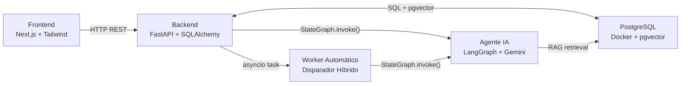
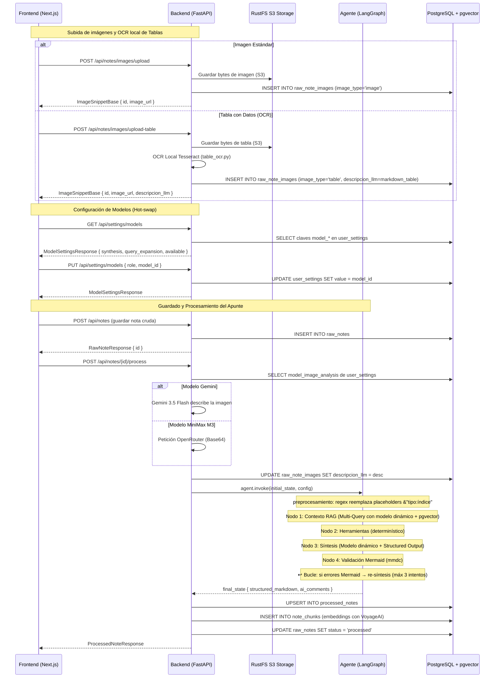
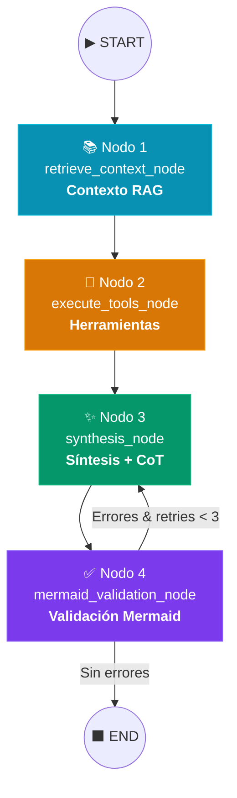
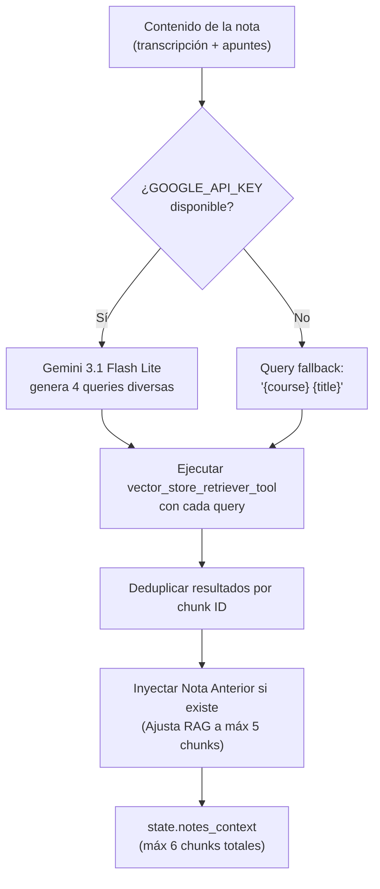
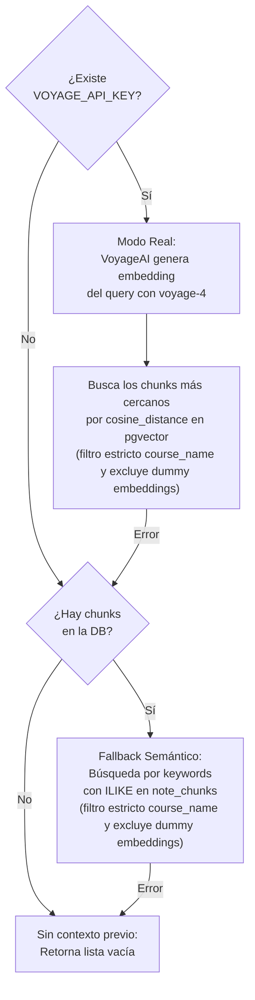
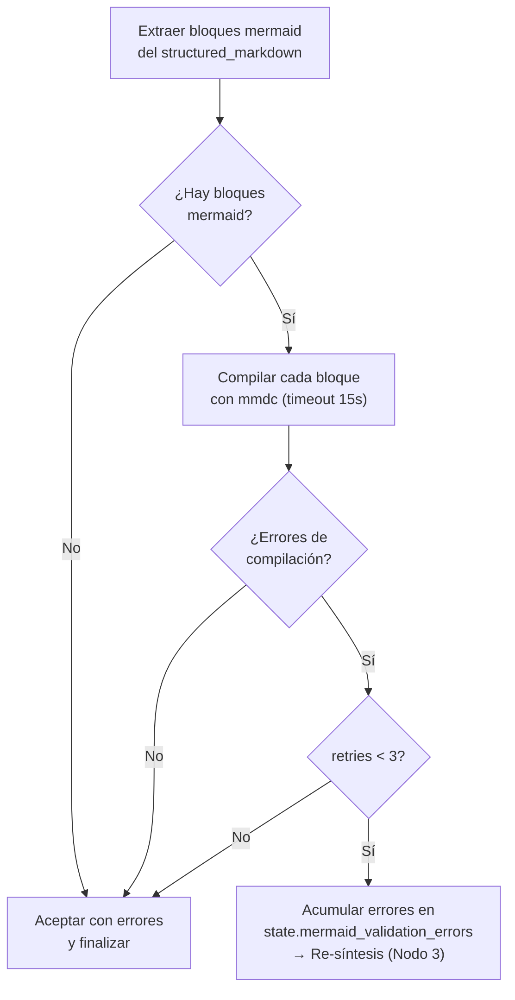
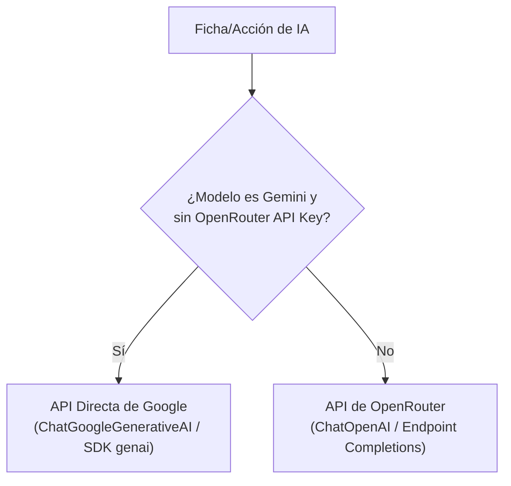
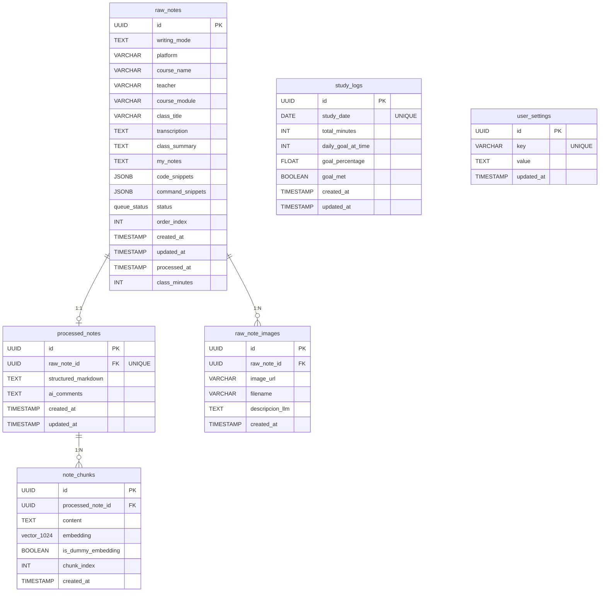
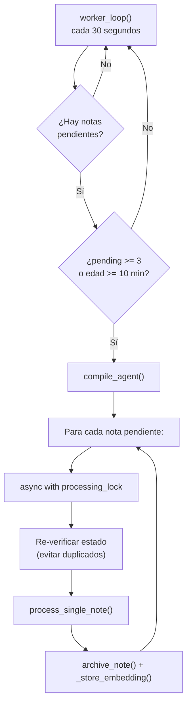

# 🧠 Arquitectura del Agente LangGraph — Documentación Técnica

## 1. Visión General del Sistema

El **Gestor Inteligente de Apuntes** es una aplicación full-stack compuesta por tres módulos desacoplados que trabajan en conjunto para transformar notas crudas de cursos en línea en fichas de estudio estructuradas en Markdown, optimizadas para Obsidian.



| Módulo | Tecnología | Responsabilidad |
|--------|-----------|-----------------|
| **Frontend** | Next.js 16, Tailwind CSS 4, Zod 4, @dnd-kit, lucide-react | Interfaz de captura de apuntes, selector dinámico de modelos de IA, cola activa con drag-and-drop y visualización de resultados |
| **Backend** | FastAPI, SQLAlchemy, Pydantic, uvicorn, Tesseract OCR, img2table | API REST, operaciones CRUD, extracción local de tablas por OCR, orquestación del agente y almacenamiento |
| **Agente IA** | LangGraph, Gemini 3.5/3.1, MiniMax M3, DeepSeek v4 Flash, pgvector | Procesamiento cognitivo con RAG, enrutamiento dinámico (Gemini/OpenRouter), síntesis con CoT y validación Mermaid |
| **Base de Datos** | PostgreSQL 16 + pgvector (Docker) | Persistencia relacional, indexación semántica (HNSW) y configuración dinámica de modelos de IA |
| **Worker** | asyncio (dentro del proceso FastAPI) | Procesamiento automático de notas pendientes en segundo plano |

---

## 2. Flujo de Procesamiento: De la Nota Cruda al Markdown

El procesamiento de un apunte sigue un flujo orquestado que inicia en el frontend, pasa por el backend y atraviesa los 4 nodos del agente LangGraph (con posible re-entrada cíclica en síntesis).

### 2.1 Secuencia de Comunicación



### 2.2 Requests HTTP del Frontend

El frontend emite las siguientes peticiones HTTP principales:

| # | Endpoint | Método | Propósito |
|---|----------|--------|-----------|
| 1 | `/api/notes` ó `/api/notes/{id}` | POST / PUT | Guarda el apunte crudo antes de procesarlo |
| 2 | `/api/notes/{id}/process` | POST | Dispara la ejecución del agente LangGraph con modelo seleccionado |
| 3 | `/api/notes/images/upload` | POST | Sube una imagen estándar para analizarla con el LLM de visión |
| 4 | `/api/notes/images/upload-table` | POST | Sube una imagen de tabla, ejecuta OCR local y genera Markdown |
| 5 | `/api/settings/models` | GET / PUT | Obtiene y actualiza en caliente los modelos de IA activos por rol |

### 2.3 Estado del Agente (`AgentState`)

El agente utiliza un `TypedDict` optimizado sin campos de plan/reasoning separados (ambos están integrados en el chain-of-thought del LLM):

```python
class AgentState(TypedDict):
    raw_note_id: str                    # UUID de la nota cruda
    raw_note_data: Dict[str, Any]       # Datos completos de la nota
    notes_context: List[str]            # Poblado por Nodo 1 (RAG)
    structured_markdown: str            # Poblado por Nodo 3 (Síntesis)
    ai_comments: str                    # Comentarios interactivos del agente
    mermaid_validation_errors: str      # Errores de compilación Mermaid (Nodo 4)
    mermaid_retries: int                # Contador de reintentos de corrección
```

### 2.4 Structured Output (`AgentOutput`)

El nodo de síntesis en modo real utiliza `with_structured_output()` de LangChain para forzar que Gemini responda en un formato JSON estructurado:

```python
class AgentOutput(BaseModel):
    chain_of_thought: str = Field(
        description="Proceso de planificación y razonamiento interno (nunca visible al usuario)."
    )
    markdown_note: str = Field(
        description="La nota procesada final en formato Markdown de Obsidian."
    )
    ai_comments: str = Field(
        description="Comentarios interactivos, preguntas o dudas para el usuario."
    )
```

### 2.5 Preprocesamiento de Placeholders Inline

Antes de invocar al LLM en el **Nodo 3 (Síntesis)**, el agente ejecuta una función de preprocesamiento sobre la transcripción cruda (`preprocess_transcription`). Esta función busca marcadores especiales en formato `&"tipo:índice"` (donde el índice se especifica en base 1) y los sustituye de manera determinista:

1. **Código (`&"codigo:X"`)**: Busca el snippet correspondiente en la lista de `code_snippets` de la nota en el índice `X - 1` y lo reemplaza por un bloque de código markdown formateado:
   ```markdown
   \n```[lenguaje]
   [código optimizado]
   \n```\n
   ```
2. **Comando (`&"comando:X"`)**: Busca el comando en `command_snippets` en el índice `X - 1` y lo reemplaza por un bloque markdown con lenguaje `bash` o el especificado:
   ```markdown
   \n```[lenguaje]
   [comando validado]
   \n```\n
   ```
3. **Imagen (`&"imagen:X"`)**: Recupera las imágenes de apoyo asociadas a la nota cruda en PostgreSQL, las ordena cronológicamente por su campo `created_at` (para garantizar un mapeo estable) y reemplaza el tag con la descripción generada previamente por Gemini 3.5 Flash (`descripcion_llm`). Si no hay descripción o falló el análisis, se conserva el tag original `&"imagen:X"` como fallback.

Este preprocesamiento intercalado optimiza la coherencia semántica al situar el contexto de apoyo exactamente donde el estudiante o profesor lo mencionó en clase antes de enviar el corpus consolidado a la síntesis del LLM.

---

## 3. Grafo del Agente: 4 Nodos con Bucle Condicional

El agente se implementa como un `StateGraph` de LangGraph con **4 nodos**. El Nodo 3 (Síntesis) realiza internamente la planeación y el razonamiento mediante chain-of-thought integrado en el System Prompt, eliminando la necesidad de nodos separados de planeación y razonamiento. El Nodo 4 introduce un **bucle condicional** que reenvía al Nodo 3 si los diagramas Mermaid tienen errores de sintaxis.



### Compilación del Grafo

```python
def compile_agent():
    workflow = StateGraph(AgentState)

    # Registro de nodos
    workflow.add_node("retrieve_context_node", retrieve_context_node)
    workflow.add_node("execute_tools_node", execute_tools_node)
    workflow.add_node("synthesis_node", synthesis_node)
    workflow.add_node("mermaid_validation_node", mermaid_validation_node)

    # Conexiones secuenciales
    workflow.set_entry_point("retrieve_context_node")
    workflow.add_edge("retrieve_context_node", "execute_tools_node")
    workflow.add_edge("execute_tools_node", "synthesis_node")
    workflow.add_edge("synthesis_node", "mermaid_validation_node")

    # Bucle condicional: si hay errores Mermaid, reenviar a síntesis
    workflow.add_conditional_edges(
        "mermaid_validation_node",
        route_mermaid,
        {
            "synthesis_node": "synthesis_node",
            END: END
        }
    )

    # Checkpointer de memoria para persistir hilos conversacionales
    memory = MemorySaver()
    return workflow.compile(checkpointer=memory)
```

---

## 4. Detalle de Cada Nodo

### 4.1 📚 Nodo 1: `retrieve_context_node` — Contexto RAG

**Propósito:** Recuperar fragmentos de notas históricas similares desde la base de datos para enriquecer el contexto del apunte actual (Retrieval-Augmented Generation), garantizando que el LLM pueda hacer conexiones pedagógicas y de continuidad entre clases del mismo plan de estudios.

**Invocación al LLM:** Sí (indirecta) — Llama a `expand_queries_with_llm()` que usa Gemini 3.1 Flash Lite para generar exactamente 4 queries diversas a partir del contenido de la nota.

#### ¿Por qué queries de IA (Multi-Query Expansion) y no chunks de la nota cruda?

La búsqueda vectorial directa utilizando fragmentos de la nota cruda suele ser ineficaz debido a varios factores inherentes al proceso de estudio:

1. **Asimetría en la Redacción:** La nota cruda (transcripciones habladas, apuntes informales o fragmentados) tiene una estructura gramatical, tono y vocabulario muy distintos de las notas finales procesadas. Al comparar un texto informal frente a un bloque formal en la base de datos, la distancia coseno de los embeddings se degrada. Las queries de IA actúan como un puente traductor, abstrayendo conceptos clave en frases de búsqueda formalizadas.
2. **Diversificación Temática (Multi-Query):** Una clase de 10-20 minutos suele tratar múltiples conceptos. Si se embeddea la nota completa, el vector representa un promedio de todos los temas, diluyendo su relevancia. Pedirle a Gemini que genere 4 queries independientes permite segmentar la búsqueda semántica en diferentes ángulos (concepto general, herramientas, comandos, flujos de algoritmos).
3. **Corrección de Errores de Transcripción (Speech-to-Text):** Los transcriptores automáticos cometen errores ortográficos o técnicos (ej. *"crear un jota son"* en vez de *"JSON"*, o *"rust efes"* por *"RustFS"*). Si se busca directamente, la base de datos no coincidirá con nada útil. La IA infiere semánticamente los nombres correctos antes de realizar las búsquedas vectoriales.
4. **Eficiencia y Latencia:** Generar embeddings de decenas de chunks de la nota cruda consumiría demasiadas llamadas a la API de embeddings síncronamente antes de la síntesis. La Multi-Query genera una sola llamada ligera de texto y restringe las búsquedas vectoriales a las 4 mejores queries de forma controlada.

#### Flujo de Multi-Query Expansion



#### Reglas de Recuperación y Límites de Chunks

El sistema ejecuta una búsqueda acotada y optimizada para no sobrecargar el prompt del agente:

* **Por Query Individual:** La herramienta `vector_store_retriever_tool` recupera un máximo de **3 chunks** de la base de datos (`limit = 3`).
* **Acumulación y Deduplicación:** Como se realizan 4 queries, se obtienen hasta 12 chunks en total. El sistema filtra esta lista deduplicándola por el ID único de los chunks.
* **Límite Total Dinámico en Prompt:**
  * Si **no existe** una nota anterior inmediata del mismo curso, se inyectan como máximo los **6 chunks** más relevantes de la búsqueda general.
  * Si **existe** una nota anterior inmediata (`order_index - 1`), se inyecta su Markdown completo como prioridad y el límite del RAG se ajusta automáticamente a un máximo de **5 chunks** (manteniendo un límite global estricto de 6 bloques de contexto).

#### RAG Híbrido Filtrado por Curso e Inyección de Continuidad
Para mantener una coherencia conceptual estricta a lo largo de un mismo plan de estudios, el proceso de recolección de contexto en el **Nodo 1** implementa dos mecanismos clave:

1. **Filtro SQL Estricto por Curso (`vector_store_retriever_tool`)**:
   - Tanto la búsqueda por similitud de coseno en `pgvector` como el fallback de búsqueda de palabras clave por `ILIKE` aplican un filtro SQL condicional estricto: `WHERE raw_notes.course_name = :course_name`. Esto evita contaminación de contexto cruzado de diferentes cursos.
   - Adicionalmente, el filtro SQL excluye explícitamente cualquier chunk que posea `is_dummy_embedding = True` para evitar lecturas de vectores vacíos.

2. **Inyección de la Nota Anterior Inmediata**:
   - `retrieve_context_node` busca en la base de datos una nota del mismo curso que posea un `order_index` exactamente igual a `current_order_index - 1`.
   - Si existe, su Markdown procesado completo se formatea e inyecta al inicio de `state["notes_context"]` bajo la etiqueta `=== NOTA ANTERIOR INMEDIATA ===`.

#### Herramienta `vector_store_retriever_tool`

La herramienta de recuperación opera con tres niveles de fallback aplicando el filtro de curso:



| Aspecto | Detalle |
|---------|---------|
| **Multi-Query Expansion** | 4 queries diversas generadas por Gemini 3.1 Flash Lite |
| **Deduplicación** | Por chunk ID (set de IDs vistos) |
| **Aislamiento por Curso** | Filtro estricto por `course_name` en consultas vectoriales y fallback léxico |
| **Inyección de Continuidad** | Inyección prioritaria de la nota procesada inmediata anterior (`order_index - 1`) del mismo curso |
| **Límites de Recuperación** | 3 chunks por query individual. Límite final acumulado de 5 (si hay nota anterior) o 6 chunks |
| **Modo real** | Embedding con VoyageAI (voyage-4, 1024 dims) → búsqueda por cosine_distance en pgvector |
| **Fallback** | Búsqueda por palabras clave con `ILIKE` en la tabla `note_chunks` (excluye dummy embeddings) |
| **Salida** | `state["notes_context"]` — Lista de hasta 6 fragmentos históricos relevantes (incluyendo nota anterior) |

---

### 4.2 🔧 Nodo 2: `execute_tools_node` — Herramientas

**Propósito:** Aplicar optimizaciones y validaciones determinísticas sobre todos los snippets de código y comandos CLI incluidos en el apunte.

**Invocación al LLM:** No — Ejecuta herramientas basadas en reglas.

Se aplican dos herramientas internas:

| Herramienta | Función | Ejemplo de optimización |
|-------------|---------|------------------------|
| `code_optimizer_tool` | Optimiza snippets de código aplicando mejores prácticas del lenguaje | Reemplaza `var` por `const` en JavaScript/TypeScript |
| `command_validator_tool` | Valida sintaxis y parámetros de comandos de terminal | Advierte sobre seguridad en `redis-cli` y buenas prácticas en `docker run` |

**Salida:** Los snippets dentro de `state["raw_note_data"]` se reemplazan por sus versiones optimizadas in-place.

---

### 4.3 ✨ Nodo 3: `synthesis_node` — Síntesis con Chain-of-Thought Integrado

**Propósito:** Compilar todo el contenido procesado (datos crudos, contexto RAG, snippets optimizados) en una nota Markdown estructurada para Obsidian, siguiendo el System Prompt de Synapse Scholar. La planeación y el razonamiento pedagógico se realizan internamente por el LLM como chain-of-thought (Sección 0 del System Prompt).

**Invocación al LLM:** Sí — Única llamada principal a Gemini 3.5 Flash con Structured Output.

| Aspecto | Detalle |
|---------|---------|
| **System Prompt** | `SYNAPSE_SCHOLAR_SYSTEM_PROMPT` — Prompt extenso que define la persona "Synapse Scholar" con Sección 0 (CoT), 6 directivas (A-F) y plantilla Obsidian |
| **User Prompt** | Incluye: título, curso, módulo, plataforma, profesor, modo de escritura, transcripción, apuntes, snippets optimizados, comandos validados y contexto RAG |
| **Structured Output** | `AgentOutput` con campos: `chain_of_thought`, `markdown_note`, `ai_comments` |
| **Formato de salida** | Markdown completo según plantilla Obsidian, con frontmatter YAML |
| **Modo corrección** | Si `mermaid_validation_errors` tiene contenido, el prompt cambia a modo "Editor/Corrector" que solo corrige diagramas Mermaid sin alterar el resto del documento |
| **Salida** | `state["structured_markdown"]` — La nota final; `state["ai_comments"]` — Comentarios interactivos |
| **Fallback (simulación)** | Motor de plantillas que construye el Markdown usando reglas heurísticas y la estructura de la plantilla base |

---

### 4.4 ✅ Nodo 4: `mermaid_validation_node` — Validación de Diagramas Mermaid

**Propósito:** Extraer todos los bloques `mermaid` del Markdown generado, compilarlos con el CLI oficial (`npx @mermaid-js/mermaid-cli`) y detectar errores de sintaxis. Si hay errores, el flujo regresa al Nodo 3 para autocorrección.

**Invocación al LLM:** No — Ejecuta compilador externo `mmdc`.



| Aspecto | Detalle |
|---------|---------|
| **Compilador** | `npx -y @mermaid-js/mermaid-cli -i file.mmd -o file.svg` |
| **Timeout** | 15 segundos por diagrama |
| **Máx reintentos** | 3 ciclos de co## 5. Las Llamadas al LLM e Intercambiabilidad (OpenRouter)

El agente es compatible tanto con las APIs directas de Google Gemini como con **OpenRouter** para el uso de modelos alternativos. Los modelos se configuran de manera dinámica por el usuario desde el panel del frontend y se persisten en la tabla `user_settings`:

| Rol de IA | Modelo Default | Modelos Alternativos Compatibles | Orquestación / Endpoint |
|---|---|---|---|
| **Llamada 0 (Query Expansion)** | `google/gemini-3.1-flash-lite` | `deepseek/deepseek-v4-flash` | Nodo 1 (RAG) — Genera queries alternativas |
| **Llamada 1 (Síntesis + CoT)** | `google/gemini-3.5-flash` | `minimax/minimax-m3` | Nodo 3 (Síntesis) — Genera el Markdown y comentarios |
| **Llamada 1b (Autocorrección)** | `google/gemini-3.5-flash` | `minimax/minimax-m3` | Nodo 3 (re-entrada) — Corrige diagramas Mermaid |
| **Visión (Análisis de Imágenes)** | `gemini-3.5-flash` | `minimax/minimax-m3` | `storage.py` (Visión) — Genera descripciones de imágenes |



---

## 6. Modo Dual: Real vs. Simulación

El agente implementa un sistema de **modo dual** que le permite funcionar tanto con conexión a APIs externas (Google / OpenRouter) como de forma completamente offline.

Los nodos que invocan al LLM siguen el patrón de verificación de llaves y persistencia:

```python
openrouter_api_key = os.getenv("OPENROUTER_API_KEY")
google_api_key = os.getenv("GOOGLE_API_KEY")

if openrouter_api_key or google_api_key:
    try:
        # 1. Obtener la preferencia de modelo de la base de datos (user_settings)
        model_name = crud.get_model_setting(db, "synthesis")
        
        # 2. Determinar si se enruta a través de OpenRouter o API Directa
        use_openrouter = openrouter_api_key and ("minimax" in model_name or not google_api_key)
        
        if use_openrouter:
            llm = ChatOpenAI(model=model_name, openai_api_key=openrouter_api_key, openai_api_base="https://openrouter.ai/api/v1")
        else:
            llm = ChatGoogleGenerativeAI(model=model_name.replace("google/", ""), google_api_key=google_api_key)
            
        structured_llm = llm.with_structured_output(AgentOutput)
        response = structured_llm.invoke(messages)
        return state
    except Exception as e:
        print(f"[ERROR] Falló llamada real al LLM: {e}. Usando simulación.")

# Fallback: Modo Simulación (motor de plantillas heurísticas offline)
state["structured_markdown"] = valor_simulado
state["ai_comments"] = comentarios_simulados
return state
```

| Modo | Activación | Comportamiento |
|------|-----------|----------------|
| **Real** | `GOOGLE_API_KEY` o `OPENROUTER_API_KEY` presentes | Invocación dinámica a Gemini, MiniMax M3 o DeepSeek v4 Flash según la configuración en caliente de la base de datos |
| **Simulación** | Sin API keys o si ocurre un error | Generación determinista del Markdown de apuntes basado en la estructura de los datos de entrada (modo offline) |

---

## 7. System Prompt: Synapse Scholar

El nodo de síntesis utiliza un System Prompt detallado llamado **Synapse Scholar** que define la personalidad, las reglas y la plantilla de salida del agente. Incluye una Sección 0 de razonamiento interno (CoT) y 6 directivas operativas:

| Sección/Directiva | Nombre | Propósito |
|-----------|--------|-----------|
| **Sección 0** | Proceso Interno de Razonamiento (CoT) | Planear, razonar y sintetizar internamente antes de producir la nota final |
| **Directiva A** | Búsqueda Web como Contrapeso | Corregir errores de speech-to-text en transcripciones verificando terminología técnica |
| **Directiva B** | Manejo de Audio Roto | Marcar fragmentos incomprensibles con `❓ Duda de Transcripción` en lugar de inventar |
| **Directiva C** | Estructura Dinámica | Detectar si es una clase nueva (plantilla completa) o continuación (solo apuntes) |
| **Directiva D** | Extracción Exhaustiva | Extraer cada concepto y generar `🧠 Zona de Procesamiento` con Wikilinks para Obsidian |
| **Directiva E** | Entrega Estructurada (JSON) | Salida apegada al esquema `AgentOutput` con `chain_of_thought`, `markdown_note` y `ai_comments` |
| **Directiva F** | Diagramas Mermaid Obligatorios | Nunca usar ASCII art; siempre usar bloques ` ```mermaid ` para flujos y diagramas |

La plantilla base de Obsidian incluye: frontmatter YAML, contexto inicial, apuntes de clase (con definiciones, procesos paso a paso, notas de cuidado, fragmentos de código y dudas de transcripción), y una zona de deconstrucción con Wikilinks sugeridos.

---

## 8. Persistencia: PostgreSQL + pgvector

### 8.1 Esquema de Base de Datos



### 8.2 Tablas y sus Roles

| Tabla | Rol | Relación |
|-------|-----|----------|
| `raw_notes` | Almacena las fichas crudas de apuntes con estado de cola (`pending`, `processed`, `failed`), `order_index` para ordenación y duración de clase | Padre |
| `processed_notes` | Almacena el Markdown estructurado generado por el agente y `ai_comments` interactivos | 1:1 con `raw_notes` |
| `note_chunks` | Fragmentos de texto por sección con embeddings vectoriales de 1024 dimensiones para búsqueda semántica. `is_dummy_embedding` indica si el vector es real o dummy | 1:N con `processed_notes` |
| `raw_note_images` | Almacena URLs (RustFS) y las descripciones textuales detalladas de las imágenes generadas por Gemini 3.5 Flash | 1:N con `raw_notes` |
| `study_logs` | Registro diario del progreso en minutos de estudio, comparados con la meta diaria del usuario | Tabla independiente |
| `user_settings` | Almacena configuraciones del usuario como pares clave-valor (ej. meta diaria `daily_study_goal`) | Tabla independiente |

### 8.3 Índices de Optimización

| Índice | Tipo | Tabla | Propósito |
|--------|------|-------|-----------|
| `idx_raw_notes_status` | B-Tree | `raw_notes` | Filtrado rápido por estado de la cola |
| `idx_raw_notes_created_at` | B-Tree | `raw_notes` | Ordenamiento cronológico |
| `idx_raw_notes_course` | B-Tree | `raw_notes` | Búsqueda por nombre de curso |
| `idx_note_chunks_embedding_hnsw` | HNSW | `note_chunks` | Búsqueda semántica ultrarrápida por distancia de coseno |
| `idx_raw_note_images_raw_note_id` | B-Tree | `raw_note_images` | Búsqueda rápida de imágenes por ID de nota cruda |

### 8.4 Flujo de Persistencia Post-Agente (Chunking Inteligente)

Una vez que el agente retorna el `structured_markdown`, el sistema ejecuta un pipeline de persistencia (`_store_embedding` en `worker.py`) que divide el Markdown en secciones lógicas para RAG granular. Este pipeline opera bajo las siguientes reglas técnicas:

1. **Archivado:** Crea o actualiza (upsert) el registro en `processed_notes` y marca la `raw_note` como `"processed"`.
2. **Chunking por Secciones Lógicas:** 
   - El Markdown completo se divide utilizando la expresión regular `re.split(r'(?=^#{2,3}\s)', markdown, flags=re.MULTILINE)`. Esto aísla cada sección que inicie con un encabezado de segundo o tercer nivel (`##` o `###`), manteniendo dicho encabezado como título del fragmento.
   - **Filtro de Ruido:** Se descartan secciones vacías o aquellas cuyo contenido útil tenga una longitud inferior a **50 caracteres**.
   - **Fallback:** Si el documento no posee ningún encabezado calificado, se toma como único fragmento de respaldo un texto construido con el resumen o título de la clase: `Resumen de clase: {raw_note.class_summary}`.
3. **Inyección de Metadatos Contextuales:**
   - Para evitar pérdidas de significado cuando los chunks se consultan individualmente fuera del documento, se prefija cada chunk con la cadena:
     `Curso: {raw_note.course_name} | Clase: {raw_note.class_title}\n`
   - El texto final del chunk (incluyendo el prefijo) se trunca a **2000 caracteres** antes del cálculo de embedding para asegurar compatibilidad con los límites del modelo de representación semántica.
4. **Cálculo de Embeddings:** Para cada chunk:
   - Si `VOYAGE_API_KEY` está configurada: inicializa el cliente de Voyage y genera el embedding real utilizando el modelo **`voyage-4`** (dimensionalidad de **1024**). Se marca `is_dummy_embedding = False`.
   - Si la llave no está presente (entorno de desarrollo local sin credenciales): inserta un vector de ceros (`[0.0] * 1024`) y marca `is_dummy_embedding = True`.
5. **Limpieza:** Elimina los chunks previos registrados para esta nota (si los hubiera) antes de persistir los nuevos, evitando duplicidad conceptual en búsquedas posteriores.
6. **Commit:** Persiste todo en PostgreSQL.

Los chunks dummy pueden re-procesarse de manera masiva con el endpoint `POST /api/embeddings/reprocess-dummies` una vez que la API key sea ingresada en la configuración.

---

## 9. Worker Automático

El backend incluye un **worker asyncio** (`worker.py`) que procesa notas pendientes en segundo plano sin intervención del usuario. Se registra como tarea en el lifespan de FastAPI.

### 9.1 Disparador Híbrido

El worker evalúa dos condiciones cada 30 segundos:

| Condición | Umbral | Descripción |
|-----------|--------|-------------|
| **Volumen** | `PENDING_THRESHOLD = 3` | Se activa cuando hay ≥3 notas pendientes acumuladas |
| **Timeout** | `MAX_WAIT_MINUTES = 10` | Se activa cuando la nota pendiente más antigua tiene ≥10 min |



### 9.2 Lock Compartido

El worker y el endpoint manual (`POST /api/notes/{id}/process`) comparten un `asyncio.Lock()` para garantizar que nunca se procese la misma nota dos veces simultáneamente. El worker siempre re-verifica el estado de la nota después de adquirir el lock.

---

## 10. Memoria del Agente: MemorySaver

El agente utiliza `MemorySaver` de LangGraph como checkpointer para mantener estados por hilo conversacional:

```python
memory = MemorySaver()
workflow.compile(checkpointer=memory)
```

Cada ejecución recibe un `thread_id` único derivado del ID de la nota:

```python
# Endpoint manual
config = {
    "configurable": {
        "thread_id": f"thread-{note_id}",
        "db": db  # Sesión de SQLAlchemy inyectada
    }
}

# Worker automático
config = {
    "configurable": {
        "thread_id": f"worker-thread-{note_id}",
        "db": db
    }
}
```

`MemorySaver` es un checkpointer **in-memory**, lo que significa que los estados conversacionales se pierden al reiniciar el servidor. Para persistencia entre reinicios, se podría migrar a `SqliteSaver` o `PostgresSaver`.

---

## 11. Script de Administración: `manage_db.py`

El script `backend/scripts/manage_db.py` proporciona operaciones de mantenimiento de base de datos via CLI:

| Comando | Descripción |
|---------|-------------|
| `backup` | Ejecuta `pg_dump` dentro del contenedor Docker y copia el dump al host |
| `restore` | Copia un archivo dump al contenedor y ejecuta `pg_restore` |
| `import` | Parsea archivos Markdown de Obsidian (con heading `# 📚`) y los importa idempotentemente a la base de datos |

El comando `import` incluye:
- Parsing de frontmatter YAML
- Extracción de metadatos (curso, módulo, profesor)
- Splitting de secciones (resumen, apuntes)
- Extracción y categorización de snippets de código y comandos
- Normalización de nombres de cursos
- Generación de embeddings con chunking inteligente
- Modo `--dry-run` para previsualizar cambios sin modificar la DB

---

## 12. Estructura de Archivos

```
proyecto-notas/
├── docker-compose.yml           # Orquestación unificada (db, storage, backend, frontend)
├── db/
│   ├── README.md                # Documentación técnica de la base de datos
│   ├── docker-compose.yml       # Contenedor PostgreSQL 16 + pgvector (independiente)
│   ├── init.sql                 # DDL: tablas (incluye logs, settings e images), índices HNSW/B-Tree y triggers
│   ├── seed_data.sql            # Datos semilla de inicialización y apuntes de prueba
│   ├── migrate_images.sql       # Script de migración para añadir soporte de imágenes
│   ├── migrate_study_tracker.sql# Script de migración para añadir logs de estudio y settings
│   ├── backup_pre_images.sql    # Respaldo histórico pre-imágenes
│   └── .env.example             # Variables de entorno para el contenedor de la DB
├── backend/
│   ├── main.py                  # Punto de entrada para desarrollo local (uvicorn)
│   ├── pyproject.toml           # Dependencias Python gestionadas con uv (boto3, google-genai, etc.)
│   ├── Dockerfile               # Receta de construcción del contenedor backend
│   ├── .env.template            # Plantilla con variables de entorno (RustFS, Gemini, Voyage)
│   ├── scripts/
│   │   └── manage_db.py         # CLI de administración: backup, restore e importación de apuntes
│   └── app/
│       ├── __init__.py          # Inicialización del paquete Python
│       ├── main.py              # API REST FastAPI, endpoints, CORS, y lifespan del worker
│       ├── agent.py             # Grafo LangGraph (4 nodos), preprocesador de placeholders, Synapse Scholar
│       ├── table_ocr.py         # Módulo de extracción de tablas por OCR (img2table + Tesseract) y fusión de renglones
│       ├── worker.py            # Worker asyncio en segundo plano, disparador híbrido y análisis de imágenes
│       ├── storage.py           # Cliente S3 (RustFS) e integración multimodal con Gemini/OpenRouter (Base64)
│       ├── models.py            # Modelos SQLAlchemy (incluye AVAILABLE_MODELS y UserSetting)
│       ├── schemas.py           # Schemas Pydantic: validaciones, inyecciones de datos y configuraciones de modelos
│       ├── crud.py              # CRUD de notas, reordenamiento e integración con borrado físico en RustFS y settings de modelos
│       └── database.py          # Configuración de sesión SQLAlchemy + driver psycopg3
├── frontend/
│   ├── package.json             # Dependencias: Next.js 16, React 19, Zod 4, @dnd-kit, lucide-react
│   ├── Dockerfile               # Contenedor Next.js standalone de producción
│   └── app/
│       ├── page.tsx             # Panel principal (dashboard)
│       ├── layout.tsx           # Layout con tipografía Geist y estilos base
│       ├── globals.css          # Estilos globales con Tailwind CSS 4
│       ├── components/
│       │   ├── Sidebar.tsx          # Sidebar: cola de apuntes, archivado y listados agrupados por curso
│       │   ├── NoteForm.tsx         # Formulario de captura de apuntes con soporte de subida de imágenes y tablas (OCR local)
│       │   ├── ResultPanel.tsx      # Visualizador de Markdown renderizado y comentarios del agente
│       │   ├── ConfirmModal.tsx     # Modal reutilizable de confirmación
│       │   ├── CourseReorderModal.tsx # Reordenación de notas por arrastre (drag-and-drop con @dnd-kit)
│       │   ├── ProcessedNotesModal.tsx # Alertas de procesamiento en segundo plano
│       │   ├── StudySettingsModal.tsx # Modal de configuración de meta de estudio, regeneración de embeddings y selector de modelos de IA
│       │   └── TemplateModal.tsx    # Selector de plantillas predefinidas
│       ├── hooks/
│       │   ├── useNotesApi.ts   # Conectores HTTP con backend (CRUD, subida de imágenes, execution de agente)
│       │   ├── useNoteForm.ts   # Controladores del formulario y validación reactiva con Zod
│       │   └── useModals.ts     # Controladores de apertura/cierre de ventanas emergentes
│       ├── schemas/
│       │   └── noteSchema.ts   # Validación estricta Zod del formulario
│       └── types/
│           └── index.ts        # Declaraciones de tipos TypeScript
├── docs/
│   └── agent-architecture.md   # Esta documentación técnica de arquitectura
└── ai-component/                # (Vacío — reservado para futuras extensiones)
```
