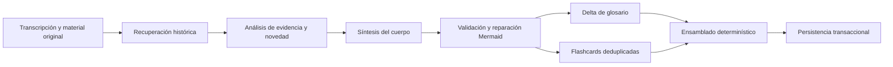

# Arquitectura del agente y memoria de conocimiento

La aplicación conserva dos pipelines. `legacy` permanece disponible como fallback y `v2` es el flujo progresivo para notas nuevas. La selección vive en `user_settings.generation_pipeline_version` y puede cambiarse sin migrar ni borrar contenido.

## Pipeline v2



1. **Recuperación:** consulta sólo clases anteriores del mismo curso. Combina evidencia original y afirmaciones, excluye la nota actual y limita la contribución por clase.
2. **Evidencia:** el modelo auxiliar clasifica afirmaciones como `NEW`, `EXTENDS`, `REPEATS`, `APPLIES`, `CLARIFIES` o `CONTRADICTS` e incluye evidencia de la clase actual.
3. **Síntesis:** el modelo principal escribe únicamente frontmatter y cuerpo. Las repeticiones se resumen; ampliaciones y aplicaciones conservan sus detalles.
4. **Suplementos:** glosario y flashcards se generan en paralelo con el modelo auxiliar. El registro histórico evita tarjetas duplicadas.
5. **Validación:** Mermaid reemplaza sólo los bloques inválidos y las tarjetas deben alcanzar exactamente el objetivo antes de ensamblarse.
6. **Ensamblado:** el servidor añade después del frontmatter una cabecera visible con título, curso, instructor, módulo y fecha de clase. Por eso esos datos sobreviven cuando el concatenador elimina el YAML de las clases posteriores.
7. **Persistencia:** `processed_notes.structured_markdown` continúa siendo la salida pública canónica. Componentes, métricas y memoria se guardan como derivados reconstruibles.

Si v2 falla antes de persistir, el worker o endpoint invoca automáticamente el grafo legacy. Cambiar el ajuste a `legacy` proporciona rollback inmediato.

## Memorias e índices

| Tabla | Contenido | Política |
|---|---|---|
| `raw_notes` | Evidencia original suministrada por el usuario | Canónica, nunca la modifica el backfill |
| `processed_notes` | Markdown final y comentarios | Contrato público compatible |
| `note_chunks` | Fragmentos de Markdown del pipeline anterior | Se conserva como fallback |
| `source_chunks` | Transcripción, apuntes, código, comandos e imágenes | Derivada y reconstruible |
| `note_claims` | Afirmaciones atómicas, evidencia y relación histórica | Derivada y reconstruible |
| `flashcard_records` | Preguntas, respuestas y huellas semánticas | Derivada y reconstruible |
| `generation_artifacts` | Cuerpo, glosario, tarjetas, manifiesto y métricas v2 | Auditoría y reparación localizada |
| `knowledge_index_states` | Checkpoint de backfill por nota | Reanudable |

Los chunks de evidencia usan ventanas aproximadas de 1,600 caracteres con 200 de solapamiento. Voyage 4 produce vectores de 1,024 dimensiones en lotes; cuando no está disponible se guarda un vector dummy marcado explícitamente.

La recuperación v2 usa el orden estable `(order_index, created_at, id)`. Esto permite continuidad incluso en cursos históricos cuyos índices están repetidos o tienen huecos, sin reescribir filas existentes.

## Operación segura

```bash
# Estado del índice
curl http://localhost:8000/api/knowledge/status

# Backfill completo reanudable, sin reescribir Markdown
docker compose exec backend python scripts/manage_db.py backfill-knowledge --all --resume --defer-embeddings --embedding-batch-size 64

# Rollback funcional inmediato
curl -X PUT http://localhost:8000/api/settings/generation-pipeline \
  -H 'Content-Type: application/json' \
  -d '{"version":"legacy"}'
```

Las migraciones son aditivas. Nunca debe usarse `docker compose down -v` durante una actualización: el volumen de PostgreSQL y RustFS permanece activo mientras se sustituye únicamente el contenedor de backend.
