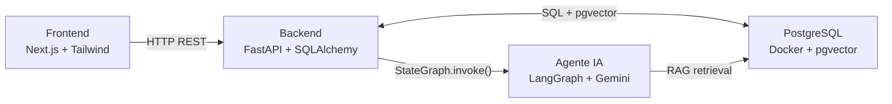
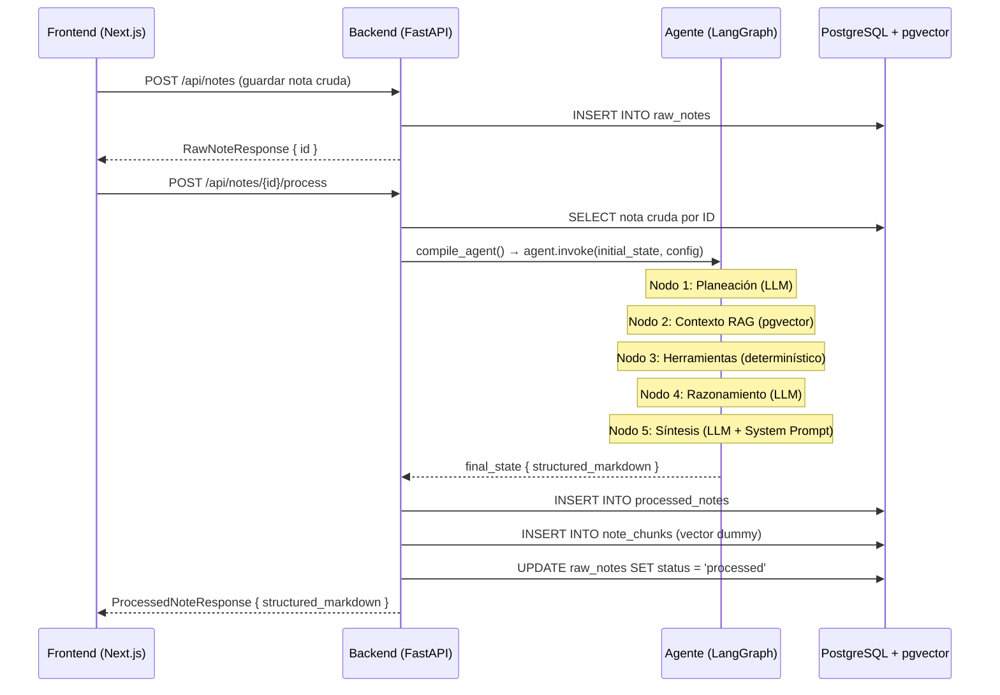
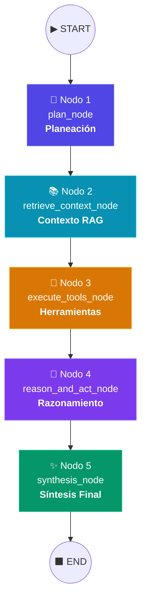
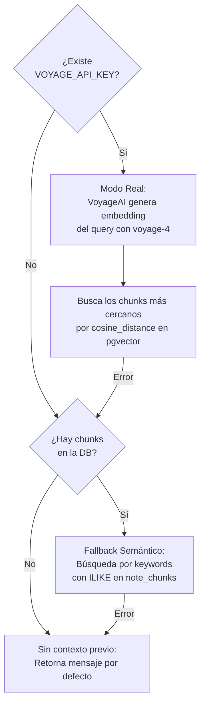
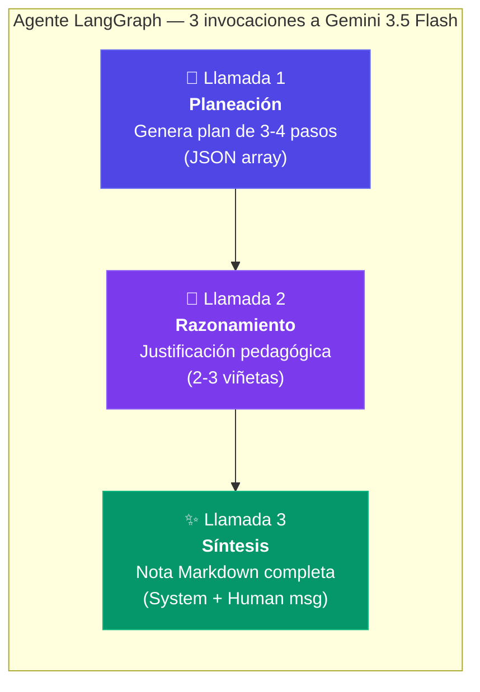
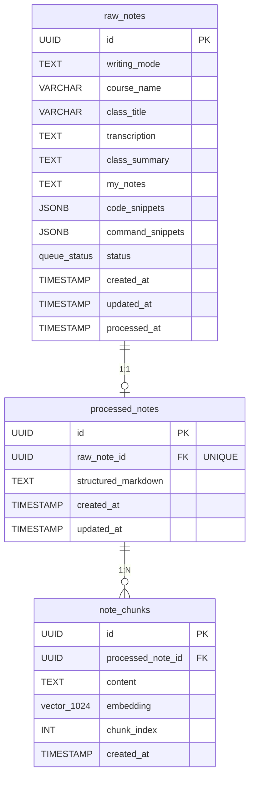

# 🧠 Arquitectura del Agente LangGraph — Documentación Técnica

## 1. Visión General del Sistema

El **Gestor Inteligente de Apuntes** es una aplicación full-stack compuesta por tres módulos desacoplados que trabajan en conjunto para transformar notas crudas de cursos en línea en fichas de estudio estructuradas en Markdown, optimizadas para Obsidian.



| Módulo | Tecnología | Responsabilidad |
|--------|-----------|-----------------|
| **Frontend** | Next.js, Tailwind CSS, Zod | Interfaz de captura de apuntes, cola activa y visualización de resultados |
| **Backend** | FastAPI, SQLAlchemy, Pydantic | API REST, operaciones CRUD, orquestación del agente |
| **Agente IA** | LangGraph, Gemini 3.5 Flash, pgvector | Procesamiento cognitivo con planeación, RAG, herramientas y síntesis |
| **Base de Datos** | PostgreSQL + pgvector (Docker) | Persistencia relacional e indexación semántica vectorial |

---

## 2. Flujo de Procesamiento: De la Nota Cruda al Markdown

El procesamiento de un apunte sigue un flujo orquestado que inicia en el frontend, pasa por el backend y atraviesa los 5 nodos del agente LangGraph.

### 2.1 Secuencia de Comunicación



### 2.2 Requests HTTP del Frontend

El frontend emite tres requests HTTP secuenciales al presionar el botón de procesamiento:

| # | Endpoint | Método | Propósito |
|---|----------|--------|-----------|
| 1 | `/api/notes` ó `/api/notes/{id}` | POST / PUT | Persiste el apunte crudo en PostgreSQL antes de procesarlo |
| 2 | *(animación local)* | — | Barras de progreso visuales simulando los nodos del agente (800ms entre pasos) |
| 3 | `/api/notes/{id}/process` | POST | Dispara la ejecución completa del agente LangGraph |

### 2.3 Estado Inicial del Agente

El backend construye el estado inicial (`AgentState`) mapeando todos los campos de la nota cruda almacenada en la base de datos:

```python
initial_state = {
    "raw_note_id": str(note_id),
    "raw_note_data": {
        "writing_mode", "platform", "course_name", "teacher",
        "course_module", "class_title", "transcription",
        "class_summary", "my_notes", "code_snippets", "command_snippets"
    },
    "plan": [],               # Poblado por Nodo 1
    "current_step": 0,
    "notes_context": [],      # Poblado por Nodo 2
    "reasoning": [],          # Poblado por Nodo 4
    "structured_markdown": "" # Poblado por Nodo 5
}
```

---

## 3. Grafo del Agente: 5 Nodos Secuenciales

El agente se implementa como un `StateGraph` de LangGraph con 5 nodos conectados en secuencia lineal. Tres de estos nodos invocan al LLM (Gemini 3.5 Flash) y dos ejecutan lógica determinística.



### Compilación del Grafo

```python
def compile_agent():
    workflow = StateGraph(AgentState)

    # Registro de nodos
    workflow.add_node("plan_node", plan_node)
    workflow.add_node("retrieve_context_node", retrieve_context_node)
    workflow.add_node("execute_tools_node", execute_tools_node)
    workflow.add_node("reason_and_act_node", reason_and_act_node)
    workflow.add_node("synthesis_node", synthesis_node)

    # Conexiones secuenciales
    workflow.set_entry_point("plan_node")
    workflow.add_edge("plan_node", "retrieve_context_node")
    workflow.add_edge("retrieve_context_node", "execute_tools_node")
    workflow.add_edge("execute_tools_node", "reason_and_act_node")
    workflow.add_edge("reason_and_act_node", "synthesis_node")
    workflow.add_edge("synthesis_node", END)

    # Checkpointer de memoria para persistir hilos conversacionales
    memory = MemorySaver()
    return workflow.compile(checkpointer=memory)
```

---

## 4. Detalle de Cada Nodo

### 4.1 🎯 Nodo 1: `plan_node` — Planeación

**Propósito:** Analizar el contenido crudo ingresado y generar un plan educativo personalizado de 3-4 pasos para estructurar la nota de estudio.

**Invocación al LLM:** Sí — Llamada #1 a Gemini 3.5 Flash.

| Aspecto | Detalle |
|---------|---------|
| **Prompt** | `"Analiza la clase '{title}' del curso '{course}'. Genera un plan educativo de estructuración en formato JSON..."` |
| **Formato de respuesta** | JSON array: `["Paso 1: ...", "Paso 2: ...", "Paso 3: ..."]` |
| **Entrada** | Título de la clase, nombre del curso, presencia de código y comandos |
| **Salida** | `state["plan"]` — Lista de pasos del plan |
| **Fallback (simulación)** | Genera un plan heurístico de 2-4 pasos basado en el tipo de contenido detectado |

---

### 4.2 📚 Nodo 2: `retrieve_context_node` — Contexto RAG

**Propósito:** Recuperar fragmentos de notas históricas similares desde la base de datos para enriquecer el contexto del apunte actual (Retrieval-Augmented Generation).

**Invocación al LLM:** No — Ejecuta la herramienta `vector_store_retriever_tool`.

La herramienta de recuperación opera con tres niveles de fallback:



| Aspecto | Detalle |
|---------|---------|
| **Query de búsqueda** | `"{course_name} {class_title}"` |
| **Modo real** | Embedding con VoyageAI (voyage-4, 1024 dims) → búsqueda por cosine_distance en pgvector |
| **Fallback** | Búsqueda por palabras clave con `ILIKE` en la tabla `note_chunks` |
| **Salida** | `state["notes_context"]` — Lista de fragmentos históricos relevantes |

---

### 4.3 🔧 Nodo 3: `execute_tools_node` — Herramientas

**Propósito:** Aplicar optimizaciones y validaciones determinísticas sobre todos los snippets de código y comandos CLI incluidos en el apunte.

**Invocación al LLM:** No — Ejecuta herramientas basadas en reglas.

Se aplican dos herramientas internas:

| Herramienta | Función | Ejemplo de optimización |
|-------------|---------|------------------------|
| `code_optimizer_tool` | Optimiza snippets de código aplicando mejores prácticas del lenguaje | Reemplaza `var` por `const` en JavaScript/TypeScript |
| `command_validator_tool` | Valida sintaxis y parámetros de comandos de terminal | Advierte sobre seguridad en `redis-cli` y buenas prácticas en `docker run` |

**Salida:** Los snippets dentro de `state["raw_note_data"]` se reemplazan por sus versiones optimizadas in-place.

---

### 4.4 🧠 Nodo 4: `reason_and_act_node` — Razonamiento

**Propósito:** Generar una justificación pedagógica de por qué la nota se organiza de cierta manera, documentando el razonamiento de diseño del agente.

**Invocación al LLM:** Sí — Llamada #2 a Gemini 3.5 Flash.

| Aspecto | Detalle |
|---------|---------|
| **Prompt** | `"Estás estructurando una ficha de estudio premium para '{title}'. Basado en el plan: {plan}, describe brevemente tu razonamiento pedagógico..."` |
| **Entrada** | Título de la clase y el plan generado en el Nodo 1 |
| **Formato de respuesta** | 2-3 viñetas de texto libre |
| **Salida** | `state["reasoning"]` — Lista de justificaciones |
| **Fallback (simulación)** | 3 viñetas predefinidas sobre legibilidad, referencias cruzadas y lectura rápida |

---

### 4.5 ✨ Nodo 5: `synthesis_node` — Síntesis Final

**Propósito:** Compilar todo el contenido procesado (datos crudos, plan, contexto RAG, snippets optimizados y razonamiento) en una nota Markdown estructurada para Obsidian, siguiendo el System Prompt de Synapse Scholar.

**Invocación al LLM:** Sí — Llamada #3 a Gemini 3.5 Flash (la más importante).

| Aspecto | Detalle |
|---------|---------|
| **System Prompt** | `SYNAPSE_SCHOLAR_SYSTEM_PROMPT` — Prompt extenso (~3000 palabras) que define la persona "Synapse Scholar" con 5 directivas estrictas |
| **User Prompt** | Incluye: título, curso, módulo, plataforma, profesor, transcripción, resumen, notas del estudiante, snippets optimizados, comandos validados y razonamiento del agente |
| **Mensajes enviados** | `[SystemMessage(SYNAPSE_SCHOLAR), HumanMessage(prompt)]` |
| **Formato de salida** | Markdown completo encapsulado en 4 backticks (Directiva E), con plantilla Obsidian |
| **Salida** | `state["structured_markdown"]` — La nota final lista para copiar a Obsidian |
| **Fallback (simulación)** | Motor de plantillas que construye el Markdown usando reglas heurísticas y la estructura de la plantilla base |

---

## 5. Las 3 Llamadas al LLM

De los 5 nodos del grafo, 3 invocan al modelo de lenguaje Gemini 3.5 Flash de Google. El siguiente diagrama resume la secuencia y el propósito de cada llamada:



---

## 6. Modo Dual: Real vs. Simulación

El agente implementa un sistema de **modo dual** que le permite funcionar tanto con conexión a APIs externas como de forma completamente offline.

Cada uno de los 3 nodos que invocan al LLM sigue el mismo patrón:

```python
google_api_key = os.getenv("GOOGLE_API_KEY")
if google_api_key:
    try:
        # Modo Real: invoca Gemini 3.5 Flash
        llm = ChatGoogleGenerativeAI(model=model_name, google_api_key=google_api_key)
        response = llm.invoke(messages)
        # ... procesar respuesta real
        return state
    except Exception as e:
        # Si falla, cae al modo simulación
        print(f"[ERROR] ... Usando simulación.")

# Modo Simulación: lógica heurística determinística
state["campo"] = valor_simulado
return state
```

| Modo | Activación | Comportamiento |
|------|-----------|----------------|
| **Real** | `GOOGLE_API_KEY` presente en `.env` | Gemini 3.5 Flash procesa los prompts; VoyageAI genera embeddings reales |
| **Simulación** | Sin API keys o si ocurre un error | Motor de reglas heurísticas genera contenido de alta fidelidad sin red |

---

## 7. System Prompt: Synapse Scholar

El nodo de síntesis utiliza un System Prompt detallado llamado **Synapse Scholar** que define la personalidad, las reglas y la plantilla de salida del agente. Sus 5 directivas son:

| Directiva | Nombre | Propósito |
|-----------|--------|-----------|
| **A** | Búsqueda Web como Contrapeso | Corregir errores de speech-to-text en transcripciones verificando terminología técnica |
| **B** | Manejo de Audio Roto | Marcar fragmentos incomprensibles con `❓ Duda de Transcripción` en lugar de inventar |
| **C** | Estructura Dinámica | Detectar si es una clase nueva (plantilla completa) o continuación (solo apuntes) |
| **D** | Extracción Exhaustiva | Extraer cada concepto y generar `🧠 Zona de Procesamiento` con Wikilinks para Obsidian |
| **E** | Entrega en 4 Backticks | Encapsular todo el Markdown dentro de `````txt` para preservar la sintaxis en formateadores |

La plantilla base de Obsidian incluye: frontmatter YAML, contexto inicial, apuntes de clase (con definiciones, procesos paso a paso, notas de cuidado, fragmentos de código y dudas de transcripción), y una zona de deconstrucción con Wikilinks sugeridos.

---

## 8. Persistencia: PostgreSQL + pgvector

### 8.1 Esquema de Base de Datos



### 8.2 Tablas y sus Roles

| Tabla | Rol | Relación |
|-------|-----|----------|
| `raw_notes` | Almacena las fichas crudas de apuntes con estado de cola (`pending`, `processed`, `failed`) | Padre |
| `processed_notes` | Almacena el Markdown estructurado generado por el agente | 1:1 con `raw_notes` |
| `note_chunks` | Fragmentos de texto con embeddings vectoriales de 1024 dimensiones para búsqueda semántica | 1:N con `processed_notes` |

### 8.3 Índices de Optimización

| Índice | Tipo | Tabla | Propósito |
|--------|------|-------|-----------|
| `idx_raw_notes_status` | B-Tree | `raw_notes` | Filtrado rápido por estado de la cola |
| `idx_raw_notes_created_at` | B-Tree | `raw_notes` | Ordenamiento cronológico |
| `idx_raw_notes_course` | B-Tree | `raw_notes` | Búsqueda por nombre de curso |
| `idx_note_chunks_embedding_hnsw` | HNSW | `note_chunks` | Búsqueda semántica ultrarrápida por distancia de coseno |

### 8.4 Flujo de Persistencia Post-Agente

Una vez que el agente retorna el `structured_markdown`, el endpoint de procesamiento ejecuta tres operaciones:

1. **Archivado:** Crea o actualiza el registro en `processed_notes` y marca la `raw_note` como `"processed"`.
2. **Inyección vectorial:** Inserta un `NoteChunk` con un vector de prueba (`[0.0] * 1024`) para validar la integración con pgvector.
3. **Commit:** Persiste todo en PostgreSQL con borrado en cascada configurado.

---

## 9. Memoria del Agente: MemorySaver

El agente utiliza `MemorySaver` de LangGraph como checkpointer para mantener estados por hilo conversacional:

```python
memory = MemorySaver()
workflow.compile(checkpointer=memory)
```

Cada ejecución recibe un `thread_id` único derivado del ID de la nota:

```python
config = {
    "configurable": {
        "thread_id": f"thread-{note_id}",
        "db": db  # Sesión de SQLAlchemy inyectada
    }
}
```

`MemorySaver` es un checkpointer **in-memory**, lo que significa que los estados conversacionales se pierden al reiniciar el servidor. Para persistencia entre reinicios, se podría migrar a `SqliteSaver` o `PostgresSaver`.

---

## 10. Estructura de Archivos

```
proyecto-notas/
├── db/
│   ├── docker-compose.yml       # Contenedor PostgreSQL + pgvector
│   └── init.sql                 # DDL: tablas, índices HNSW, triggers
├── backend/
│   ├── main.py                  # Punto de entrada (uvicorn)
│   ├── .env                     # Variables de entorno (API keys)
│   └── app/
│       ├── main.py              # API REST FastAPI, endpoint /process
│       ├── agent.py             # Grafo LangGraph: 5 nodos, 3 herramientas, system prompt
│       ├── models.py            # Modelos SQLAlchemy (RawNote, ProcessedNote, NoteChunk)
│       ├── schemas.py           # Schemas Pydantic de entrada/salida
│       ├── crud.py              # Operaciones CRUD + archive_note
│       └── database.py          # Configuración SQLAlchemy + psycopg3
├── frontend/
│   └── app/
│       ├── page.tsx             # Página principal Next.js
│       ├── components/          # Sidebar, NoteForm, ResultPanel, Modals
│       ├── hooks/
│       │   ├── useNotesApi.ts   # Orquestación de 3 requests HTTP + procesamiento IA
│       │   ├── useNoteForm.ts   # Estado del formulario y validación
│       │   └── useModals.ts     # Estado de modales de confirmación
│       ├── schemas/             # Validación Zod
│       └── types/               # Tipos TypeScript
└── ai-component/                # (Vacío — reservado para futuras extensiones)
```
